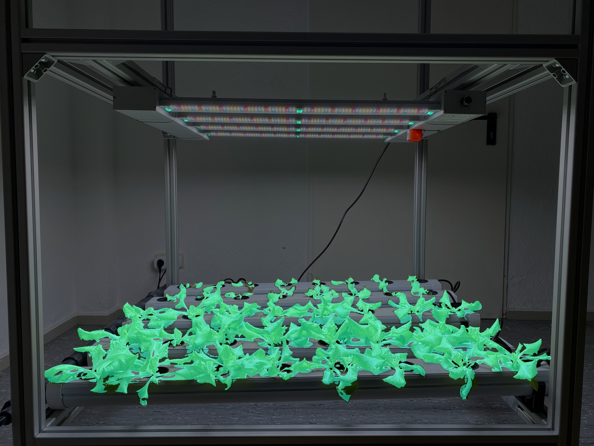
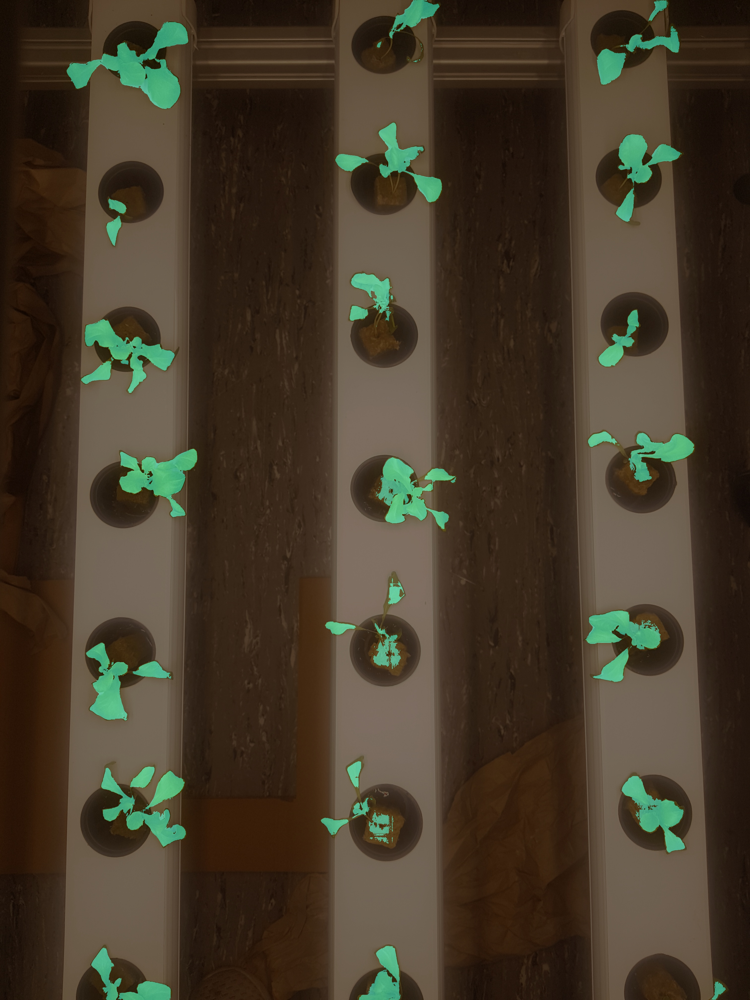

<div align="center">
  
</div>
<br />


[](https://pypi.org/project/mmsegmentation/)
[](https://pypi.org/project/mmsegmentation)
[](https://mmsegmentation.readthedocs.io/en/latest/)
[](https://github.com/open-mmlab/mmsegmentation/actions)
[](https://codecov.io/gh/open-mmlab/mmsegmentation)
[](https://github.com/open-mmlab/mmsegmentation/blob/master/LICENSE)
[](https://github.com/open-mmlab/mmsegmentation/issues)
[](https://github.com/open-mmlab/mmsegmentation/issues)


## About Hexafarms

Hexafarm provides A-Z solutions for indoor farming industries.<br />
MMSegmentation has been used as a base network to segment leaves.<br />
This segmented leaves are used to track the growth of plants.<br />
If you are interested, contact to huijo.k@hexafarms.com

## What is special in Hexafarms'github ?

- **AzureML friendly**

You can use AzureML with MMsegmentaiton

- **Plant leaves Customdataset Config**

Customdataset config is updated for 0: background, 1: leaf

<div align="center">
  
  
</div>

## About MMSegmentation

Documentationof MMsegmentation: https://mmsegmentation.readthedocs.io/

English | [简体中文](README_zh-CN.md)

MMSegmentation is an open source semantic segmentation toolbox based on PyTorch.
It is a part of the OpenMMLab project.

The master branch works with **PyTorch 1.3+**.


### Major features

- **Unified Benchmark**

  We provide a unified benchmark toolbox for various semantic segmentation methods.

- **Modular Design**

  We decompose the semantic segmentation framework into different components and one can easily construct a customized semantic segmentation framework by combining different modules.

- **Support of multiple methods out of box**

  The toolbox directly supports popular and contemporary semantic segmentation frameworks, *e.g.* PSPNet, DeepLabV3, PSANet, DeepLabV3+, etc.

- **High efficiency**

  The training speed is faster than or comparable to other codebases.

## License

This project is released under the [Apache 2.0 license](LICENSE).


## Installation

Please refer to [get_started.md](docs/get_started.md#installation) for installation and [dataset_prepare.md](docs/dataset_prepare.md#prepare-datasets) for dataset preparation.

## Get Started

Please see [train.md](docs/train.md) and [inference.md](docs/inference.md) for the basic usage of MMSegmentation.
There are also tutorials for [customizing dataset](docs/tutorials/customize_datasets.md), [designing data pipeline](docs/tutorials/data_pipeline.md), [customizing modules](docs/tutorials/customize_models.md), and [customizing runtime](docs/tutorials/customize_runtime.md).
We also provide many [training tricks](docs/tutorials/training_tricks.md) for better training and [usefule tools](docs/useful_tools.md) for deployment.

A Colab tutorial is also provided. You may preview the notebook [here](demo/MMSegmentation_Tutorial.ipynb) or directly [run](https://colab.research.google.com/github/open-mmlab/mmsegmentation/blob/master/demo/MMSegmentation_Tutorial.ipynb) on Colab.

## Citation

If you find this project useful in your research, please consider cite:

```latex
@misc{mmseg2020,
    title={{MMSegmentation}: OpenMMLab Semantic Segmentation Toolbox and Benchmark},
    author={MMSegmentation Contributors},
    howpublished = {\url{https://github.com/open-mmlab/mmsegmentation}},
    year={2020}
}
```